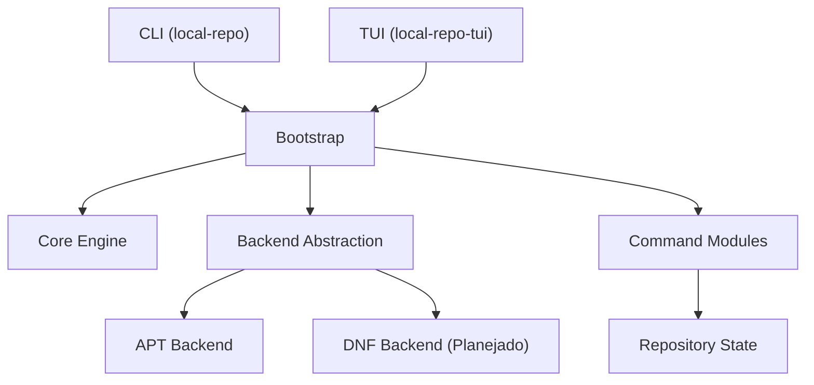
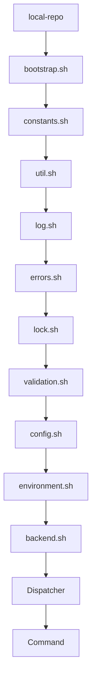
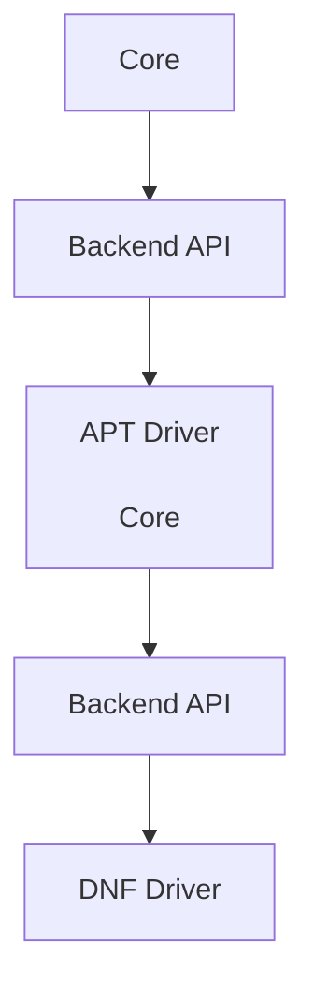
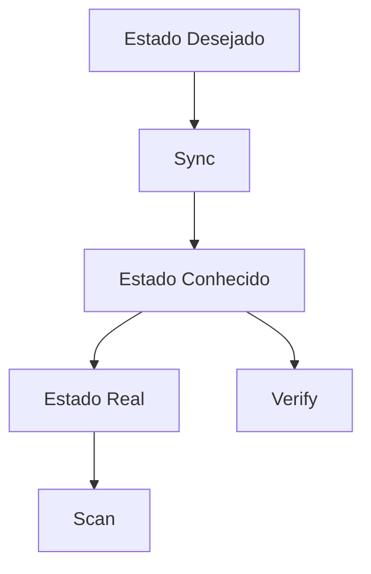
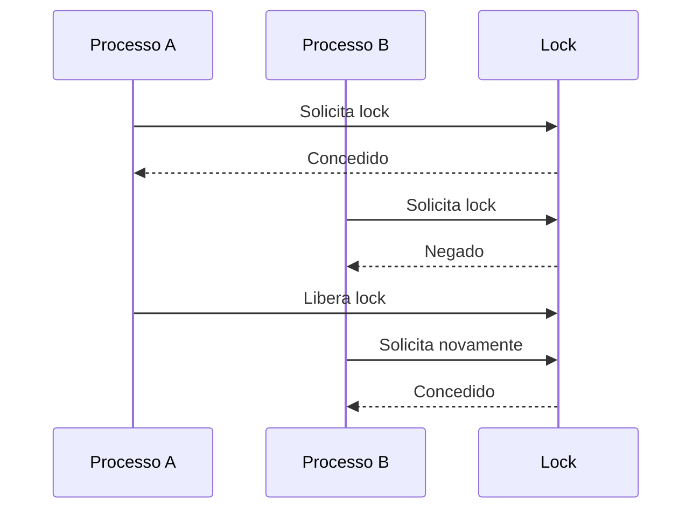

<!-- ========================================================= -->
<!-- local-repo README                                         -->
<!-- ========================================================= -->

# local-repo

<div align="center">

## Gerenciador Declarativo de Repositórios Locais de Pacotes para Linux

### Crie, sincronize e mantenha repositórios Linux portáteis para instalações totalmente offline utilizando um modelo declarativo inspirado em ferramentas modernas de Infraestrutura como Código.

**Offline-first • Declarativo • Portátil • Incremental • Modular**

<br>

[](LICENSE)


</div>

---

# Introdução

## O que é o local-repo? (De forma simples)

Imagine que você precisa instalar ferramentas de diagnóstico de hardware, monitoramento ou manutenção (como `htop`, `tmux` ou `smartmontools`) em um computador com Linux que **não tem nenhuma conexão com a internet** (computadores isolados por segurança, servidores em locais de difícil acesso ou laboratórios trancados). 

Se você apenas baixar o arquivo `.deb` ou `.rpm` em um pen drive na sua máquina de trabalho e tentar instalar lá no cliente offline, o sistema provavelmente vai falhar acusando a falta de outros arquivos secundários (as famosas **dependências**).

O **local-repo** resolve esse problema agindo como um "montador de repositório portátil inteligente":
1. **Você declara o que quer:** Você simplesmente lista em um arquivo de texto os programas que precisa ter disponíveis.
2. **Ele resolve o trabalho pesado:** Na sua máquina com internet, o `local-repo` calcula, localiza e baixa o programa escolhido **junto com absolutamente todas as dependências recursivas** que ele precisa para funcionar, organizando tudo em uma estrutura limpa de pastas.
3. **Você transporta e usa:** Você copia essa pasta para um pen drive ou SSD externo, conecta na máquina isolada e pronto! Você tem um repositório local e completo para instalar o que quiser de forma 100% offline, rápida e segura.

---

### Para quem é este projeto?

* **Estudantes e Curiosos:** Que desejam aprender na prática como o ecossistema Linux gerencia árvores de pacotes por baixo dos panos ou precisam abastecer ambientes de estudos isolados.
* **Técnicos e Analistas de Suporte:** Que realizam manutenção de campo em servidores isolados, redes industriais ou computadores corporativos restritos.
* **Administradores de Sistemas e Engenheiros DevOps/SRE:** Que buscam automatizar a infraestrutura de forma previsível utilizando conceitos modernos de Infraestrutura como Código (IaC) e modelos declarativos aplicados a mídias físicas portáteis.

---

### Estado do Projeto

> [!WARNING]
> 
> O **local-repo** está em desenvolvimento ativo.
> 
> Embora a arquitetura principal esteja estabilizada e documentada, parte das funcionalidades descritas neste README encontra-se em implementação.
> 
> A documentação procura refletir tanto os recursos já disponíveis quanto a direção arquitetural planejada para as próximas versões.
> 
> O objetivo é manter uma evolução incremental sem comprometer os princípios fundamentais do projeto.

---

## Um repositório local inteligente para ambientes Linux

O **local-repo** é um gerenciador declarativo de repositórios locais de pacotes desenvolvido para distribuições Linux.

Seu objetivo é permitir que administradores de sistemas mantenham **coleções portáteis de pacotes**, juntamente com suas dependências, possibilitando instalações completamente **offline**, sincronização incremental e recuperação automática de estado.

Ao contrário de ferramentas focadas em espelhamento completo (*mirroring*), o **local-repo** trabalha apenas com aquilo que realmente interessa ao administrador: um conjunto específico de pacotes descrito em um simples arquivo texto.

O projeto foi concebido para seguir princípios modernos de engenharia de software, separando explicitamente:

- o que o administrador deseja;
- o que o sistema acredita possuir;
- o que realmente existe em disco.

Essa separação permite auditorias, reconstrução automática de inventários, detecção de divergências (*drift detection*) e maior confiabilidade operacional.

---

### O problema

Administradores Linux frequentemente precisam instalar software em ambientes onde a Internet não está disponível ou não pode ser utilizada.

Alguns exemplos:

- servidores isolados (*air-gapped*);
- laboratórios de ensino;
- ambientes industriais;
- datacenters restritos;
- máquinas virtuais descartáveis;
- notebooks utilizados em campo;
- infraestrutura corporativa com acesso limitado à Internet.

Embora distribuições Linux possuam excelentes gerenciadores de pacotes, manter um **repositório local pequeno, portátil e continuamente atualizado** ainda costuma exigir soluções improvisadas.

Entre os problemas mais comuns estão:

- baixar novamente pacotes já existentes;
- perda do inventário do repositório;
- dificuldade para transportar repositórios entre máquinas;
- ausência de controle declarativo sobre quais pacotes devem existir;
- duplicação desnecessária de arquivos;
- dependência permanente de conexão com os repositórios oficiais;
- necessidade de servidores dedicados para tarefas relativamente simples.

Em muitos casos, as soluções existentes priorizam grandes espelhos (*mirrors*) ou infraestrutura corporativa complexa, quando o administrador deseja apenas manter um conjunto consistente de pacotes para reutilização futura.

---

### A solução

O **local-repo** propõe uma abordagem diferente.

Em vez de perguntar continuamente **"o que existe?"**, ele parte da pergunta:

> **"O que eu quero que exista?"**

Essa resposta é descrita em um simples arquivo texto.

A partir dele, o sistema calcula automaticamente as diferenças entre três camadas independentes de informação:

```text
Estado Desejado
        │
        ▼
Estado Conhecido
        │
        ▼
Estado Real
```

Sempre que necessário, o mecanismo de convergência sincroniza essas camadas.

Na prática isso significa que o administrador apenas mantém uma lista declarativa de pacotes.

Todo o restante — resolução de dependências, download incremental, atualização do inventário, reconstrução de índices e auditoria estrutural — passa a ser responsabilidade do próprio sistema.

O resultado é um repositório local:

- portátil;
- reproduzível;
- transparente;
- auditável;
- resiliente;
- preparado para funcionar sem acesso à Internet.

---

## Casos de uso

O projeto foi concebido para atender desde usuários domésticos até administradores responsáveis por centenas de máquinas.

### Administração corporativa

- criação de repositórios internos;
- redução do consumo de banda;
- padronização de ambientes;
- provisionamento rápido de novos servidores;
- controle sobre versões distribuídas.

### Ambientes sem acesso à Internet

- servidores air-gapped;
- redes militares;
- laboratórios de pesquisa;
- infraestrutura industrial;
- ambientes críticos.

### Laboratórios de ensino

- instalação simultânea em diversas máquinas;
- preparação de imagens para aulas;
- redução de downloads repetitivos;
- manutenção simplificada.

### Home Labs

Excelente para quem mantém:

- Proxmox;
- KVM;
- VirtualBox;
- VMware;
- Docker Hosts;
- clusters Raspberry Pi;
- servidores domésticos.

### Recuperação de desastres

Após reinstalar um servidor basta apontar novamente para o repositório local.

Não é necessário baixar novamente milhares de pacotes.

### Desenvolvimento

Muito útil para desenvolvedores que frequentemente:

- recriam máquinas virtuais;
- trabalham offline;
- mantêm ambientes reproduzíveis;
- utilizam diferentes distribuições Linux.

---

## Posicionamento do projeto

### O que o projeto NÃO pretende ser

O **local-repo** não pretende substituir soluções corporativas completas de gerenciamento de repositórios.

Não faz parte do escopo:

- espelhamento completo de distribuições;
- servidores HTTP próprios;
- gerenciamento de usuários;
- autenticação;
- alta disponibilidade;
- bancos de dados SQL;
- interfaces web administrativas.

Seu foco é oferecer uma solução simples, robusta e portátil para gerenciamento de repositórios locais.

O ecossistema Linux possui diversas ferramentas maduras para criação, espelhamento e distribuição de repositórios de pacotes. Projetos como `reprepro`, `aptly`, `apt-mirror` e `apt-cacher-ng` atendem muito bem a diferentes necessidades operacionais.

O **local-repo** não pretende substituir essas soluções. Seu objetivo é oferecer uma abordagem complementar, focada em repositórios locais declarativos, portabilidade, sincronização incremental e operação offline, mantendo uma arquitetura simples, transparente e baseada apenas em arquivos texto.

A tabela abaixo compara o foco de cada solução em relação aos objetivos deste projeto.

| Característica | local-repo | reprepro | aptly  | apt-mirror | apt-cacher-ng |
|----------------|:----------:|:--------:|:------:|:----------:|:-------------:|
| Operação offline | ✅ | ✅ | ✅ | ⚠️ | ⚠️ |
| Modelo declarativo | ✅ | ❌ | ❌ | ❌ | ❌ |
| Portabilidade do repositório | ✅ | ⚠️ | ⚠️ | ❌ | ❌ |
| Sincronização incremental | ✅ | ✅ | ✅ | ✅ | ✅ |
| Recuperação automática do inventário | ✅ | ❌ | ❌ | ❌ | ❌ |
| Separação entre estado desejado, conhecido e real | ✅ | ❌ | ❌ | ❌ | ❌ |
| Sem banco de dados | ✅ | ✅ | ❌ | ✅ | ❌ |
| Sem serviços residentes | ✅ | ✅ | ✅ | ✅ | ❌ |

> **Nota:** esta tabela destaca diferenças de abordagem e escopo, e não estabelece uma classificação de qualidade entre as ferramentas.

---

# Índice

- [Requisitos](#requisitos)
	- [Backend APT](#backend-apt)
	- [Backend DNF](#backend-dnf-planejado)
- [Instalação](#instalação)
- [Primeiros Passos](#primeiros-passos)
- [Comandos](#comandos)
- [Arquivos de Configuração](#arquivos-de-configuração)
- [Arquitetura](#arquitetura)
- [Camadas da Arquitetura](#camadas-da-arquitetura)
- [Princípios Arquiteturais](#princípios-arquiteturais)

---

# Requisitos

## Sistema Operacional

- Linux
- Bash 5.0+
- util-linux
- coreutils
- grep
- sed
- awk

---

## Backend APT

Pacotes necessários:

```bash
sudo apt install \
    dpkg-dev \
    apt-utils \
    dpkg \
    fdupes \
    util-linux
```

---

## Backend DNF *(Planejado)*

```bash
sudo dnf install \
    createrepo_c \
    rpm \
    dnf-plugins-core
```

---

# Instalação

> Em breve.

> [!WARNING]
> O **local-repo** encontra-se em desenvolvimento ativo.
>
> A interface de linha de comando e a arquitetura já estão definidas, porém parte das funcionalidades descritas abaixo será implementada nas próximas versões.
>
> Este README documenta tanto recursos já implementados quanto recursos planejados para a versão estável.

Quando disponível, bastará executar:

```bash
git clone https://github.com/rulestux/local-repo.git

cd local-repo

sudo ./install.sh
```

---

# Primeiros Passos

## 1. Inicialize um repositório

```bash
sudo local-repo init
```

O comando cria automaticamente:

```text
REPO_BASE_DIR/

├── pool/
│
├── state/
│   ├── packages.list
│   └── packages.state
│
├── log/
│
└── run/
```

---

## 2. Adicione um pacote

```bash
sudo local-repo download curl
```

O pacote passa a fazer parte do estado desejado.

Caso ainda não exista na pool local, será baixado juntamente com suas dependências.

---

## 3. Sincronize o repositório

```bash
sudo local-repo sync
```

O mecanismo de convergência compara:

```
packages.list

↓

packages.state

↓

pool/
```

e baixa apenas aquilo que estiver ausente.

---

## 4. Instale utilizando o repositório local

```bash
sudo local-repo install curl
```

Após garantir que o repositório esteja consistente, o pacote é instalado utilizando exclusivamente a infraestrutura local.

---

## Exemplo de Fluxo Completo

```text
Administrador

↓

local-repo download docker.io

↓

Atualiza packages.list

↓

Executa Sync

↓

Resolve dependências

↓

Baixa arquivos

↓

Atualiza packages.state

↓

Reconstrói Packages.gz

↓

Pronto.
```

---

# Comandos

## Criando um novo repositório

```bash
sudo local-repo init
```

Saída esperada:

```text
✔ Detectando distribuição...

✔ Detectando backend...

✔ Criando estrutura...

✔ Inicializando estado...

✔ Repositório criado com sucesso.
```

---

## Baixando um pacote

```bash
sudo local-repo download git
```

Saída esperada:

```text
✔ Registrando intenção...

✔ Calculando diferenças...

✔ Resolvendo dependências...

✔ Baixando pacotes...

✔ Atualizando inventário...

✔ Reconstruindo índices...

✔ Operação concluída.
```

---

## Importando um repositório existente

Além de criar um repositório vazio, o **local-repo** pode importar repositórios já existentes a partir de diferentes fontes.

Durante a importação, o sistema adapta automaticamente a estrutura ao modelo interno do projeto, reconstruindo o inventário e preparando o repositório para futuras sincronizações.

### A partir de uma imagem ISO

```bash
sudo local-repo import --from-iso debian-13.1.0-amd64-DVD-1.iso
```

Fluxo da operação:

```text
Imagem ISO

↓

Montagem temporária

↓

Validação da estrutura

↓

Importação da pool

↓

Reconstrução do inventário

↓

Reconstrução dos índices

↓

Repositório pronto
```

### A partir de um diretório

Importa um repositório já existente armazenado em outro diretório.

```bash
sudo local-repo import --from-directory /srv/repository
```

### A partir de um dispositivo USB

O dispositivo pode ser identificado pelo UUID, LABEL ou ponto de montagem.

```bash
sudo local-repo import --from-usb DebianRepository
```

ou

```bash
sudo local-repo import --from-usb 4A8D-19F2
```

### A partir de um arquivo compactado

Também é possível restaurar um repositório previamente exportado.

```bash
sudo local-repo import --from-tar backup.tar.zst
```

Durante a importação, o sistema:

- valida a origem dos dados;
- importa os pacotes para a `pool/`;
- reconstrói o inventário (`packages.state`);
- atualiza os índices do repositório;
- verifica a integridade da estrutura importada.

Saída esperada:

```text
✔ Validando origem...

✔ Importando pacotes...

✔ Reconstruindo inventário...

✔ Atualizando índices...

✔ Verificando integridade...

✔ Importação concluída com sucesso.
```

Após a importação, o repositório passa a ser gerenciado normalmente pelos comandos `sync`, `verify`, `update` e `upgrade`.

---

## Exportando um repositório

O **local-repo** também permite exportar repositórios para facilitar backups, migrações ou distribuição entre máquinas.

A exportação preserva a estrutura necessária para que o repositório possa ser restaurado posteriormente utilizando o comando `import`.

### Exportando para um arquivo compactado

```bash
sudo local-repo export --to-tar backup-2026-07-07.tar.zst
```

Fluxo da operação:

```text
Repositório

↓

Validação

↓

Compactação

↓

Arquivo .tar.zst
```

Durante a exportação, o sistema:

- verifica a integridade do repositório;
- inclui a `pool/`;
- inclui os arquivos de estado;
- inclui a configuração necessária para restauração;
- gera um arquivo compactado pronto para transporte ou armazenamento.

Saída esperada:

```text
✔ Validando repositório...

✔ Coletando arquivos...

✔ Compactando...

✔ Gerando backup...

✔ Exportação concluída.
```

O arquivo gerado pode ser restaurado posteriormente com:

```bash
sudo local-repo import --from-tar backup-2026-07-07.tar.zst
```

---

## Instalando um pacote

```bash
sudo local-repo install git
```

Fluxo interno:

```text
download()

↓

sync()

↓

backend_install()
```

---

## Atualizando os metadados

```bash
sudo local-repo update
```

Exemplo:

```text
Pacotes desatualizados

----------------------

curl

git

docker.io

openssl
```

---

## Atualizando o repositório

```bash
sudo local-repo upgrade
```

O comando:

- baixa novas versões;
- remove versões antigas;
- atualiza o inventário;
- reconstrói os índices.

---

## Verificando a integridade

```bash
sudo local-repo verify
```

Exemplo:

```text
Verificando checksums...

Verificando inventário...

Verificando duplicidades...

Nenhum problema encontrado.
```

---

## Reconstruindo o inventário

```bash
sudo local-repo scan
```

Caso o arquivo `packages.state` seja perdido ou corrompido, o sistema reconstrói automaticamente o inventário utilizando os próprios arquivos existentes na `pool/`.

---

## Detectando divergências

```bash
local-repo diff
```

Exemplo:

```text
Estado Desejado

---------------

curl

git

docker

Estado Conhecido

----------------

curl

git

Diferenças

----------

+ docker
```

---

## Removendo pacotes órfãos

```bash
sudo local-repo prune
```

Exemplo:

```text
Os seguintes pacotes não pertencem mais ao estado desejado:

libfoo

libbar

Deseja removê-los?

[y/N]
```

---

## Purgando um pacote

```bash
sudo local-repo purge firefox
```

Fluxo:

```text
packages.list

↓

packages.state

↓

pool/

↓

Packages.gz
```

---

## Referência da CLI

| Comando | Descrição |
|----------|-----------|
| `init` | Inicializa um novo repositório |
| `download` | Baixa pacotes sem instalar |
| `install` | Baixa e instala utilizando o repositório local |
| `remove` | Remove do sistema operacional |
| `purge` | Remove permanentemente do repositório |
| `sync` | Converge os estados |
| `update` | Atualiza metadados remotos |
| `upgrade` | Atualiza pacotes locais |
| `verify` | Verifica integridade |
| `scan` | Reconstrói inventário |
| `diff` | Detecta divergências |
| `prune` | Remove órfãos |
| `search` | Pesquisa pacotes |
| `info` | Exibe metadados |
| `stats` | Estatísticas do repositório |
| `clean` | Remove arquivos temporários |

---

# Dicas

✅ Versione o arquivo `packages.list` em Git.

✅ Faça backup periódico da pasta `pool/`.

✅ Utilize `verify` antes de exportar um repositório.

✅ Execute `update` regularmente.

✅ Utilize `prune` para remover pacotes obsoletos.

✅ Utilize `scan` apenas quando houver necessidade de reconstrução do inventário.

---

# Arquivos de Configuração

## Configuração global

```
/etc/local-repo/local-repo.conf
```

Exemplo:

```bash
REPO_BASE_DIR="/srv/local-repo"

LOG_LEVEL="INFO"

BACKEND="apt"
```

---

## Estado Desejado

```
state/packages.list
```

Exemplo:

```text
curl|amd64

git|amd64

docker.io|amd64
```

---

## Estado Conhecido

```
state/packages.state
```

Exemplo:

```text
curl|8.16.0|amd64|manual|2026-07-06

git|2.51.0|amd64|manual|2026-07-06

libssl3|3.0.13|amd64|dependency|2026-07-06
```

---

## Logs

```
log/local-repo.log
```

Exemplo:

```text
INFO Bootstrap iniciado

INFO Backend detectado: apt

INFO Sync iniciado

INFO Inventário atualizado
```

---

## Lock

```
run/local-repo.lock
```

Criado automaticamente durante operações críticas.

---

# Arquitetura

A arquitetura do **local-repo** foi concebida para privilegiar simplicidade operacional, previsibilidade e facilidade de manutenção.

Desde o início do projeto, algumas decisões foram consideradas inegociáveis:

- separação rigorosa de responsabilidades;
- ausência de componentes residentes (*daemons*);
- ausência de bancos de dados;
- armazenamento transparente baseado em arquivos texto;
- desacoplamento entre a lógica do sistema e o gerenciador de pacotes da distribuição;
- possibilidade de expansão para múltiplos ecossistemas Linux.

O resultado é uma arquitetura modular, onde cada componente possui uma responsabilidade única e bem definida.

---

## Visão Geral



Todo o sistema é inicializado por um **dispatcher extremamente pequeno**, cuja única responsabilidade consiste em carregar o ecossistema e transferir o controle para o mecanismo de bootstrap.

A partir desse ponto, cada subsistema assume uma função específica.

---

## Fluxo de Inicialização

O ciclo de vida da aplicação foi projetado para seguir sempre a mesma sequência.

Isso torna o comportamento previsível, facilita testes e reduz efeitos colaterais.



A ordem de carregamento é determinística.

Cada módulo depende exclusivamente das camadas inferiores, reduzindo acoplamentos desnecessários.

---

## Organização do Projeto

```
local-repo/
│
├── local-repo
├── local-repo-tui
│
├── lib/
│   │
│   ├── core/
│   ├── backend/
│   ├── api/
│   └── commands/
│
├── tui/
│
├── install.sh
├── uninstall.sh
│
└── README.md
```

Cada diretório representa um domínio específico da aplicação.

---

# Camadas da Arquitetura

## Dispatcher

Responsável apenas por iniciar a aplicação.

Ele não:

- contém regras de negócio;
- descobre diretórios;
- conhece backends;
- manipula estados.

Sua única responsabilidade é iniciar o Bootstrap.

---

## Bootstrap

O Bootstrap é o verdadeiro orquestrador do sistema.

Suas responsabilidades incluem:

- localizar a raiz do projeto;
- carregar os módulos do Core;
- inicializar o sistema de logs;
- carregar configurações;
- validar o ambiente;
- adquirir travas de concorrência;
- descobrir o backend ativo;
- iniciar o dispatcher de comandos.

Toda inicialização do framework passa obrigatoriamente por ele.

---

## Core

O Core reúne toda a infraestrutura compartilhada da aplicação.

Entre seus componentes estão:

| Módulo | Responsabilidade |
|---------|------------------|
| constants.sh | Constantes globais |
| config.sh | Configuração |
| validation.sh | Validações |
| environment.sh | Auditoria do ambiente |
| log.sh | Logging |
| errors.sh | Tratamento de exceções |
| lock.sh | Controle de concorrência |
| util.sh | Funções utilitárias |

Esses módulos não conhecem detalhes sobre APT ou DNF.

---

## Backend

Uma das principais decisões arquiteturais do projeto foi desacoplar completamente a lógica do sistema operacional.

Em vez de espalhar chamadas para `apt`, `dpkg` ou `dnf` pelo código, toda interação ocorre através de uma camada de abstração.



Isso permite que novos gerenciadores de pacotes sejam adicionados sem alterações significativas no restante da aplicação.

---

## Módulos

Cada comando possui um módulo próprio.

Exemplos:

```
download.sh

install.sh

sync.sh

verify.sh

scan.sh

stats.sh
```

Isso evita arquivos gigantescos e facilita manutenção.

---

# Princípios Arquiteturais

O desenvolvimento do **local-repo** é orientado por um conjunto de princípios que norteiam todas as decisões de arquitetura e implementação.

Esses princípios procuram garantir que o projeto permaneça simples, previsível e sustentável à medida que evolui.

---

## Offline-first

O acesso à Internet deve ser tratado como um recurso opcional. Todas as operações possíveis são executáveis sem acesso à Internet.

Sempre que possível, operações como instalação, auditoria, reconstrução do inventário e consultas de metadados devem funcionar integralmente utilizando apenas os dados disponíveis no repositório local.

Conexões com repositórios remotos devem ocorrer exclusivamente quando forem realmente necessárias para sincronização ou atualização.

---

## Declaratividade

O administrador informa **o estado desejado**, e não a sequência de passos para alcançá-lo. O sistema decide **como convergir** para esse estado.

Em vez de executar operações imperativas repetidamente, basta manter um manifesto declarativo (`packages.list`).

Cabe ao sistema determinar quais ações são necessárias para convergir o ambiente até esse estado.

---

## Recuperabilidade

Todo artefato derivado deve poder ser reconstruído.

Isso significa que informações armazenadas em índices, inventários ou bancos textuais nunca devem ser a única fonte da verdade.

Caso um arquivo seja perdido ou corrompido, o sistema deve ser capaz de regenerá-lo utilizando os dados físicos disponíveis.

---

## Transparência

Os estados internos do sistema pertencem ao administrador.

Por essa razão, são armazenados em formatos abertos e legíveis, permitindo inspeção e manipulação utilizando ferramentas tradicionais do ecossistema UNIX, como `grep`, `awk`, `sed`, `sort` e `cut`.

O projeto evita formatos binários ou estruturas proprietárias sempre que possível.

---

## Modularidade

Cada componente deve possuir uma responsabilidade claramente definida.

A lógica de negócio permanece desacoplada das particularidades de cada distribuição Linux, permitindo que múltiplos backends (APT, DNF etc.) sejam incorporados sem alterações significativas na arquitetura principal.

---

## Determinismo

Dadas as mesmas entradas, o sistema deve produzir sempre o mesmo estado final.

Esse princípio simplifica auditorias, facilita testes e reduz comportamentos inesperados.

Sempre que possível, decisões implícitas ou dependentes do ambiente devem ser evitadas.

---

## Idempotência

Operações repetidas não devem produzir efeitos colaterais desnecessários.

Executar um comando de sincronização sobre um repositório já sincronizado, por exemplo, deve resultar apenas na verificação do estado existente, sem downloads redundantes ou modificações desnecessárias.

---

## Incrementalidade

O sistema deve reutilizar tudo aquilo que já está disponível localmente.

Downloads, reconstruções e atualizações devem ocorrer apenas quando houver uma diferença real entre o estado atual e o estado desejado.

Esse princípio reduz consumo de banda, tempo de execução e espaço em disco.

---

## Portabilidade

Todo o repositório deve ser facilmente transportável entre diferentes máquinas ou dispositivos de armazenamento:

- SSD externo;
- HD externo;
- pendrive;
- outro servidor;
- outro diretório.

A estrutura do projeto procura evitar dependências de caminhos absolutos ou configurações específicas do sistema hospedeiro, permitindo que um repositório seja movido para outro ambiente com o mínimo de intervenção.

---

## Auditabilidade

As decisões tomadas pelo sistema devem ser compreensíveis e verificáveis.

Sempre que possível, operações importantes geram registros em log e mantêm seus estados representados de forma explícita.

O administrador deve conseguir responder perguntas como:

- Qual pacote foi adicionado?
- Quando isso ocorreu?
- Por que ele faz parte do repositório?
- O que mudou desde a última sincronização?

sem depender de ferramentas externas ou informações ocultas.

---

## Simplicidade

A simplicidade é tratada como um requisito arquitetural.

Antes de adicionar novas funcionalidades, o projeto procura reduzir complexidade, reutilizar componentes existentes e preservar uma estrutura compreensível.

Sempre que duas soluções forem equivalentes em funcionalidade, a mais simples tende a ser preferida.

---

## Filosofia UNIX

Sempre que possível, o projeto procura seguir a filosofia tradicional do ecossistema UNIX:

- fazer uma coisa e fazê-la bem;
- utilizar formatos de dados simples;
- favorecer composição em vez de acoplamento;
- integrar-se naturalmente às ferramentas já disponíveis no sistema operacional.

Essa abordagem reduz dependências, facilita automação e mantém o comportamento previsível para administradores Linux.

---

## Extensibilidade

Embora a primeira implementação seja destinada ao ecossistema Debian/APT, a arquitetura foi concebida para permitir novos backends.

Planejados:

- DNF
- MicroDNF
- Zypper
- Pacman *(em avaliação)*

O objetivo é manter um núcleo único, reutilizando a maior parte da infraestrutura existente.

---

## Modelo dos Três Estados

O conceito central do **local-repo** é a separação entre intenção, conhecimento e realidade.


Esses três elementos representam estados completamente independentes.

---

### Estado Desejado

Arquivo:

```
packages.list
```

Representa aquilo que o administrador deseja manter no repositório.

Exemplo:

```text
curl|amd64
git|amd64
docker.io|amd64
```

É o único arquivo que pode ser editado manualmente.

Pode inclusive ser versionado em Git.

---

### Estado Conhecido

Arquivo:

```
packages.state
```

Representa o inventário interno gerado automaticamente pelo sistema.

Contém informações como:

- versão;
- arquitetura;
- tipo;
- data de registro.

Caso seja perdido, pode ser reconstruído.

---

### Estado Real

Diretório:

```
pool/
```

Representa os arquivos físicos existentes no repositório.

É a fonte definitiva da verdade.

---

### Convergência

O objetivo do sistema não é apenas armazenar pacotes.

Seu objetivo é **convergir** continuamente esses três estados.



Essa abordagem oferece diversas vantagens:

- reconstrução automática;
- auditoria;
- detecção de divergências;
- sincronização incremental;
- maior previsibilidade.

---

## Layout do Repositório

```text
REPO_BASE_DIR/

├── pool/
│
├── state/
│   ├── packages.list
│   └── packages.state
│
├── run/
│   └── local-repo.lock
│
└── log/
    └── local-repo.log
```

Cada diretório possui uma finalidade específica.

| Diretório | Finalidade |
|------------|------------|
| pool | Pacotes físicos |
| state | Estados declarativos |
| run | Arquivos temporários e locks |
| log | Auditoria |

---

## Controle de Concorrência

Operações que modificam o repositório utilizam travas baseadas em `flock`.



Isso evita corrupção causada por múltiplas execuções simultâneas.

---

## Portabilidade

Todo o repositório pode ser movido para outro local sem necessidade de reconstrução.

```
SSD

↓

USB

↓

Outro servidor

↓

Outro diretório

↓

Mesmo repositório
```

Como os estados são independentes de caminhos absolutos, basta atualizar a configuração da aplicação.

---

## Filosofia de Desenvolvimento

Além da arquitetura técnica, o projeto adota alguns princípios durante sua implementação.

- responsabilidade única;
- baixo acoplamento;
- alta coesão;
- modularidade;
- inicialização determinística;
- infraestrutura desacoplada;
- interfaces explícitas;
- arquivos pequenos;
- documentação antes da implementação;
- arquitetura antes das funcionalidades.

Esses princípios tornam o projeto mais previsível, mais fácil de manter e preparado para evoluir ao longo do tempo.

---

## Decisões de Projeto

Durante o desenvolvimento, algumas decisões foram tomadas deliberadamente.

| Decisão | Motivação |
|---------|-----------|
| GNU Bash | Disponibilidade em praticamente todas as distribuições Linux |
| Arquivos texto | Transparência e simplicidade |
| Sem banco de dados | Facilidade de recuperação |
| Sem daemon | Menor consumo de recursos |
| Sem servidor web | Redução da complexidade |
| Backend abstrato | Expansão futura |
| Estados independentes | Auditoria e recuperação |
| Estrutura modular | Evolução incremental |

---

## Objetivos de Longo Prazo

O **local-repo** busca evoluir preservando sua filosofia original.

Isso significa que novas funcionalidades devem respeitar alguns princípios fundamentais:

- simplicidade antes de complexidade;
- previsibilidade antes de automação excessiva;
- transparência antes de abstrações ocultas;
- portabilidade antes de otimizações específicas;
- estabilidade antes da quantidade de funcionalidades.

Mais do que adicionar novos recursos, o objetivo é manter uma base arquitetural consistente, capaz de crescer sem perder suas características originais.


